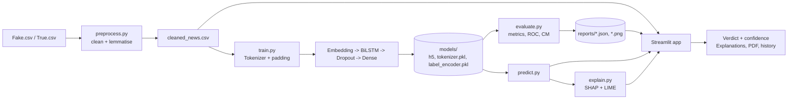

# Explainable Fake News Detection Using Deep Learning

A web app that classifies news articles as **FAKE** or **REAL** with a BiLSTM network and explains every prediction with **SHAP** and **LIME**.

**GitHub description:** *Explainable fake news detector: BiLSTM (TensorFlow/Keras) + SHAP & LIME word-level explanations, Streamlit dashboard with EDA, model analytics, prediction history and PDF reports.*

## Features
- Preprocessing: missing values, lowercase, special-char removal, tokenisation, stop-words, lemmatisation -> `cleaned_text`
- EDA: class balance, subjects, length distribution, word frequencies, Fake-vs-Real vocabulary (interactive Plotly)
- Model: Tokenizer -> padding -> Embedding -> BiLSTM -> Dropout -> Dense(sigmoid); EarlyStopping + ModelCheckpoint
- Evaluation: accuracy, precision, recall, F1, ROC/AUC, confusion matrix
- XAI: SHAP (word highlights + importance), LIME (importance + widget), merged keyword table, plain-English "why"
- App: 6 pages, PDF report download, saved prediction history, dark theme, responsive layout

## Architecture


## Structure
```
Explainable-Fake-News-Detection/
├── data/            Fake.csv, True.csv (you add these)
├── notebooks/       EDA.ipynb
├── models/          fake_news_model.h5, tokenizer.pkl, label_encoder.pkl (+ config.json, test_data.npz)
├── src/             preprocess.py train.py evaluate.py explain.py predict.py report.py
├── app/             streamlit_app.py
├── reports/         metrics.json, history.json, PNG plots, prediction_history.csv
├── .streamlit/      config.toml (dark theme)
├── Dockerfile  requirements.txt  README.md  .gitignore
```

## Setup
```bash
python3.11 -m venv .venv
source .venv/bin/activate            # Windows: .venv\Scripts\activate
pip install -r requirements.txt
```
Download the [Fake and Real News Dataset](https://www.kaggle.com/datasets/clmentbisaillon/fake-and-real-news-dataset) and place `Fake.csv` and `True.csv` in `data/`.

## Run
```bash
python -m src.preprocess                          # builds data/cleaned_news.csv (few minutes, once)
python -m src.train --epochs 8 --batch-size 128   # trains, saves model, runs evaluation
python -m src.train --sample 4000 --epochs 2      # optional quick smoke test first
python -m src.evaluate                            # re-run evaluation only
python -m src.explain --text "Your article..."    # saves SHAP/LIME PNGs to reports/
streamlit run app/streamlit_app.py                # launch the dashboard
```
Docker: `docker build -t fakenews . && docker run -p 8501:8501 -v $(pwd)/models:/app/models -v $(pwd)/reports:/app/reports fakenews`

Always run commands from the project root (the `-m src.xxx` form relies on it).

## Design notes
- **Label leakage:** in this dataset almost every REAL article contains "(Reuters)" and many FAKE ones contain "via", "featured image", "getty images". The cleaner strips these so the model learns content and style rather than publisher tags. Expect very high scores (typically 97-99%+) even so; this dataset is known to be easy, so treat results as dataset-specific, not proof the model generalises to all news.
- **Padding:** "pre" padding and "post" truncation so the LSTM's final state sees real tokens.
- **Explanations:** both SHAP (Partition explainer + text masker) and LIME query the full raw-text -> clean -> model pipeline, and explain P(REAL). Positive = toward REAL, negative = toward FAKE. Word-level attributions describe the model's behaviour, not factual truth.
- **Runtime:** SHAP takes ~10-60 s on CPU depending on length; LIME a few seconds. Explanations are cached per article in the session.
- Not verified in the build environment: I could only syntax-check the code there (no TensorFlow/network). Run the smoke test above first and report any version issues; dependency versions are pinned to a known-compatible set.

## Sample outputs (illustrative, not measured)
```
Prediction: FAKE   Confidence: 96.4%   P(REAL)=0.036
Words pushing toward FAKE: 'breaking', 'shocking', 'liberal', 'video'
Words pulling toward REAL: 'spokesman', 'ministry'
```

## Screenshot descriptions
| Page | What you see |
|---|---|
| Home | Four metric cards (accuracy/precision/recall/F1), problem statement, pipeline list |
| Dataset Insights | Donut of class balance, grouped subject bars, overlaid length histograms, top-word bars for each class, over-represented-words charts |
| Model Training | Summary cards (epochs, best val accuracy, time), metrics table, per-epoch history, architecture, optional train button |
| News Detector | Text box, coloured FAKE/REAL badge, confidence bar and gauge, PDF button, history table with CSV download |
| Explainability Dashboard | Article text shaded green/red per word, SHAP and LIME bar charts, REAL/FAKE keyword tables, plain-English reason |
| Model Analytics | Accuracy/loss curves, ROC curve with AUC, confusion-matrix heatmap, per-class report |

## Resume bullets
- Built an end-to-end explainable fake-news detector using a BiLSTM in TensorFlow/Keras on ~44k articles, achieving **[your test accuracy / F1]** on a held-out set.
- Engineered a reproducible NLP pipeline (cleaning, lemmatisation, tokenisation, padding) and removed publisher-tag label leakage to improve the trustworthiness of results.
- Integrated SHAP and LIME to produce word-level attributions, highlighted text and plain-English rationales for each prediction.
- Delivered a six-page Streamlit dashboard with EDA, ROC/confusion-matrix analytics, prediction history, PDF reports and Docker deployment.

## Deployment
Streamlit Community Cloud: push the repo **with trained `models/`** (remove the `models/*` lines from `.gitignore` or use Git LFS), set main file to `app/streamlit_app.py`, Python 3.11.

## Troubleshooting
- *"No trained model found"*: run `python -m src.train`.
- *NLTK download errors*: `python -c "import nltk; nltk.download('stopwords'); nltk.download('wordnet')"`.
- *SHAP is slow*: lower "SHAP: words analysed" in the dashboard.
